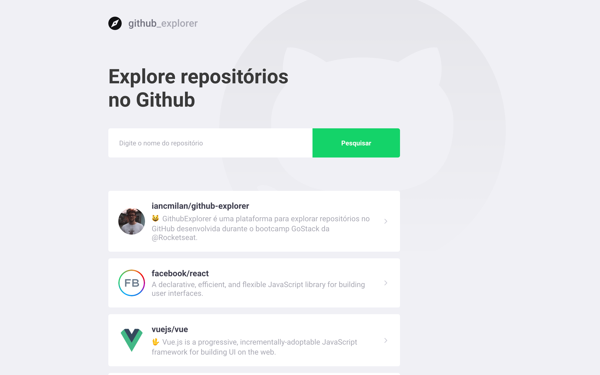
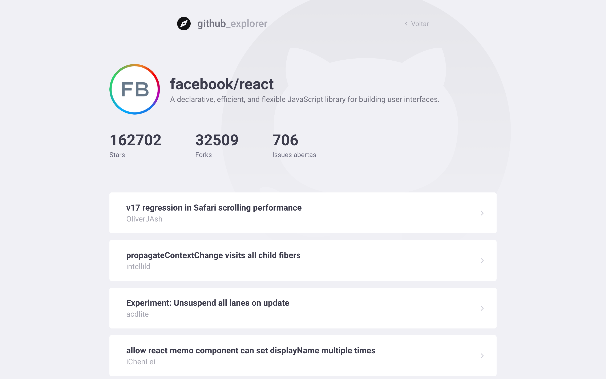

<div align="center">

![web] ![top_language] ![repo-size]

</div>

### Projeto desenvolvido durante o GoStack da [Rocketseat] utilizando a tecnologia **ReactJS**.


## :bookmark: Sobre

**GithubExplorer** é uma plataforma para explorar repositórios no GitHub.

## :computer: Layout da aplicação

### Dashboard



### Informações do repositório



## :rocket: Tecnologias

- [ReactJS](https://reactjs.org)

## :wrench: Como utilizar

#### Faça um clone do repositório:

```sh
  $ git clone https://github.com/iancmilan/github-explorer.git
```
#### Execute a aplicação:

```sh
  # vá para a pasta do projeto
  $ cd github-explorer
  # instale as dependências do projeto
  $ yarn # ou npm install

  # execute a aplicação
  $ yarn start # ou npm start
```
## :memo: Licença

Esse projeto está sob licensa [MIT](LICENSE).

<!-- Links -->
[Rocketseat]: https://rocketseat.com.br/

<!-- Bagdes -->
[web]: https://img.shields.io/badge/web-React-63DAFA?style=flat-square
[top_language]: https://img.shields.io/github/languages/top/iancmilan/github-explorer?style=flat-square
[repo-size]: https://img.shields.io/github/repo-size/iancmilan/github-explorer?style=flat-square
